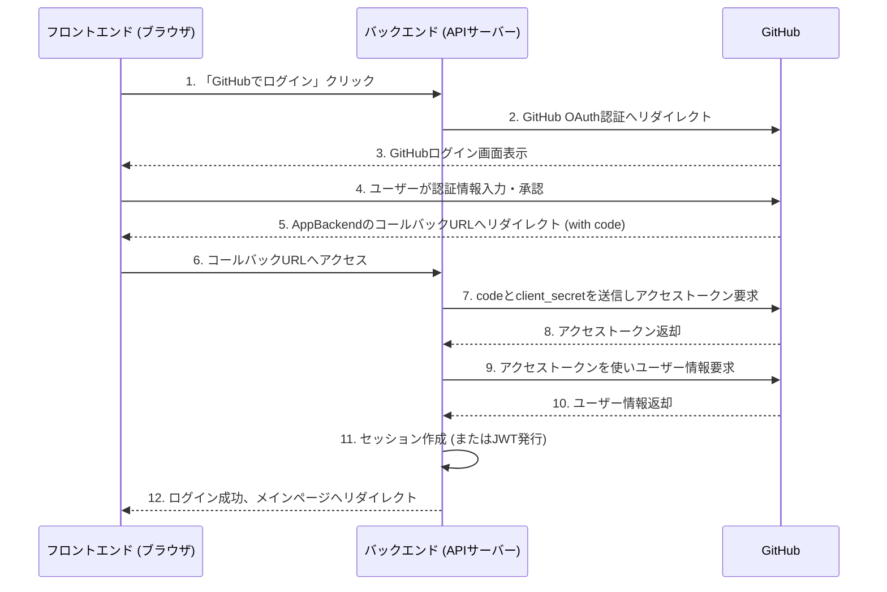
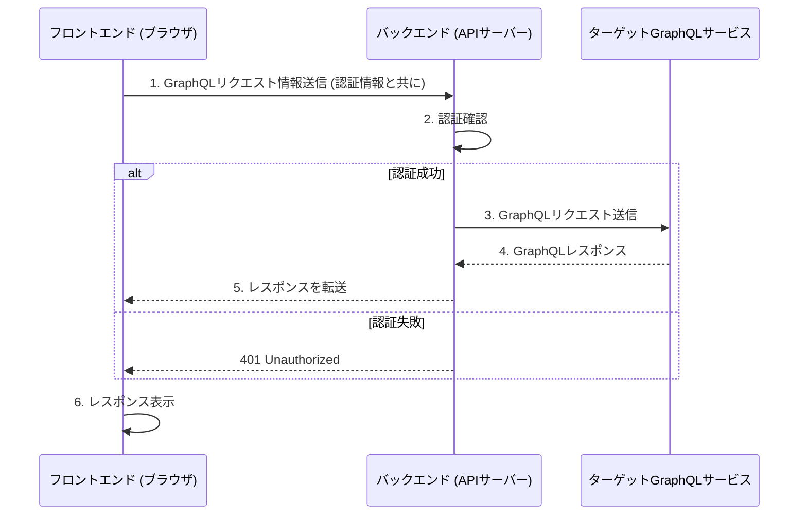

# my-gql-proxy

個人用のGraphQLクライアントWebアプリケーション。

## 機能一覧

- GitHub認証でログインできる
- マイページでは、GraphQLサーバーを登録できる
- マイページでは、登録したGraphQLサーバーを一覧表示できる
- マイページでは、登録したGraphQLサーバーの項目を変更できる
- マイページでは、登録したGraphQLサーバーを削除できる
- マイページでGraphQLサーバーを指定すると、新しいリクエストを入力できる
- マイページでGraphQLサーバーを指定して新しいリクエストを入力すると、リクエストを実行できる
- マイページでGraphQLサーバーを指定して新しいリクエストを入力してリクエストを実行すると、レスポンスを表示できる
- マイページでGraphQLサーバーを指定すると、過去に実行したリクエストとレスポンスの対の履歴を一覧表示できる
- マイページでGraphQLサーバーを指定して過去に実行したリクエストとレスポンスの対の履歴を指定すると、リクエストとレスポンスを表示できる

### 画面一覧

- ログインページ
- マイページ

### 主な処理フロー

1. ユーザーが Web アプリにアクセス
2. GitHub認証でログイン
3. マイページでGraphQLサーバー情報を管理（登録・編集・削除・一覧）
4. 選択したGraphQLサーバーに対してリクエストを作成・実行、レスポンスを表示
5. リクエスト/レスポンス履歴をDBに保存し、一覧・個別表示

## アーキテクチャ

SPA

## GitHub Copilot の提案

- **要件整理**:
  - 機能一覧、画面一覧、主な処理フローを基に、必要な機能と画面を具体化。
  - 必要なAPIエンドポイントとデータ構造を設計。

- **技術スタック選定**:
  - フロントエンド: React + Vite + TypeScript。
  - バックエンド: Node.js + Express + TypeScript。
  - 認証: GitHub OAuth。
  - データベース: SQLite（簡易な履歴保存用）。
  - 状態管理: React Query（API通信とキャッシュ管理）。

- **フロントエンド設計**:
  - ページ構成: ログインページ、マイページ。
  - コンポーネント設計: ログインボタン、GraphQLサーバー管理フォーム、リクエスト入力フォーム、レスポンス表示エリア、履歴一覧。

- **バックエンド設計**:
  - APIエンドポイント:
    - `/auth/github`（GitHub認証開始）
    - `/auth/github/callback`（GitHub認証コールバック）
    - `/api/graphql`（GraphQLリクエストプロキシ）
    - `/api/history`（リクエスト/レスポンス履歴管理）
  - セッション管理: CookieベースまたはJWT。

- **データベース設計**:
  - テーブル: `users`（ユーザー情報）、`graphql_servers`（登録サーバー）、`request_history`（リクエスト履歴）。

- **実装フロー**:
  1. GitHub OAuth認証の実装。
  2. フロントエンドの画面とコンポーネント作成。
  3. バックエンドAPIの実装。
  4. フロントエンドとバックエンドの統合。
  5. 履歴保存と表示機能の実装。
  6. テストとデバッグ。

- **デプロイ**:
  - フロントエンド: VercelまたはNetlify。
  - バックエンド: RenderまたはHeroku。
  - 環境変数でGitHub OAuthクライアント情報を管理。

- **テスト**:
  - ユニットテスト: Jest。
  - E2Eテスト: Playwright。TBD

## Gemini の提案

> このリポジトリのreadmeに書いてある機能を実装して、変更PRを作成して欲しい。
> 
https://g.co/gemini/share/f00307ea52b7

## Google AI Studioの提案

Google AI Studio によって提案された、このリポジトリのコア機能（GitHub認証でログインし、登録したURLに指定したGraphQLリクエストを送信し、レスポンスを表示できる）を実現するためのミニマムなアーキテクチャ案です。

### 1. 主要コンポーネント

1.  **フロントエンド (Web UI):**
    *   **役割:** ユーザーインターフェースの提供、ユーザー入力の受付、バックエンドAPIとの通信。
    *   **機能:**
        *   GitHubログインボタン。
        *   ログイン後:
            *   GraphQLエンドポイントURLの入力フィールド。
            *   GraphQLクエリ入力エリア。
            *   GraphQL変数入力エリア (JSON形式)。
            *   (オプション) カスタムHTTPヘッダー入力フィールド。
            *   リクエスト送信ボタン。
            *   GraphQLレスポンス表示エリア。
            *   ログアウト機能。
    *   **技術スタック例:** React, Vue.js, Next.js, SvelteKit など + HTML/CSS/JavaScript。

2.  **バックエンド (APIサーバー):**
    *   **役割:** 認証処理、フロントエンドからのリクエスト仲介、外部GraphQLサービスへのリクエスト送信。
    *   **機能:**
        *   **GitHub OAuth認証エンドポイント:** `/auth/github`, `/auth/github/callback`
        *   **GraphQLリクエストプロキシエンドポイント (認証必須):** 例: `POST /api/execute-graphql`
            *   フロントエンドから `targetUrl`, `query`, `variables`, `headers` を受け取り、ターゲットにリクエストを送信。
        *   **ユーザーセッション/認証状態確認エンドポイント:** 例: `GET /api/me`
        *   **ログアウトエンドポイント:** 例: `POST /api/logout`
    *   **技術スタック例:** Node.js + Express.js / Fastify / NestJS など。

3.  **設定管理:**
    *   `config.yaml` (または環境変数) で GitHub OAuth情報、セッションキーなどを管理。

### 2. データストア (オプション、主にセッション管理用)

*   **Redis / データベース:** セッションストアとして利用可能。

### 3. リクエスト処理フロー (概要)

#### 3.1 ユーザーログインフロー

#### 3.2 GraphQLリクエスト実行フロー

### 4. メリット

- シンプル: 実装が比較的容易。
- セキュア: ユーザー認証を導入。
- 柔軟性: 任意のGraphQLエンドポイントに対応。
